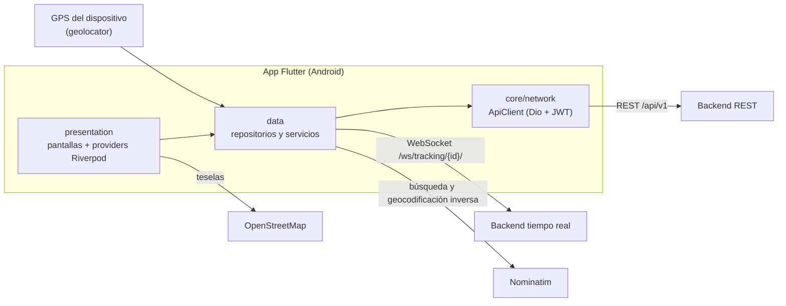
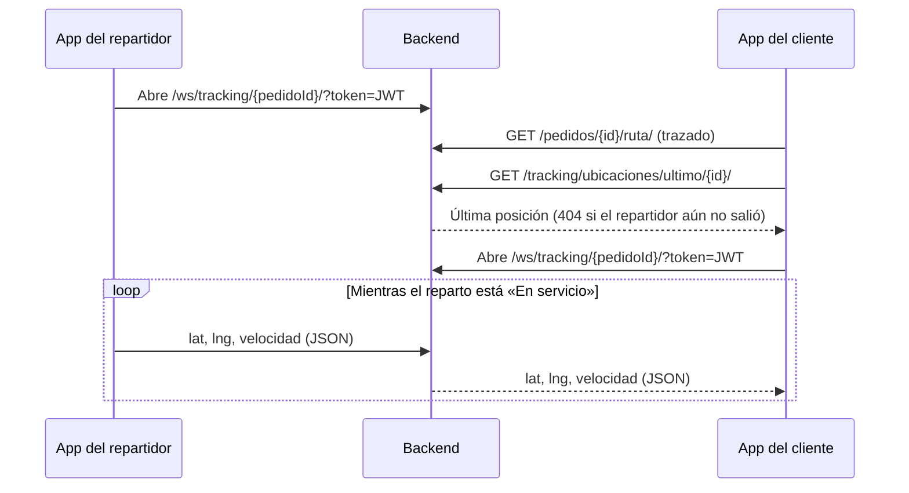

# Logística Móvil


Aplicación móvil en Flutter para un sistema de logística y envíos. El **cliente** crea pedidos y los sigue en un mapa en tiempo real; el **repartidor** gestiona sus entregas, su recorrido y comparte su ubicación mientras reparte.

> [!NOTE]
> Este repositorio contiene **solo el cliente móvil**. El backend (API REST y WebSocket) es un proyecto independiente que no está incluido aquí; la app necesita uno en ejecución para funcionar. Ver [API consumida](#api-consumida).

[Descripción](#descripción) · [Características](#características) · [Tecnologías](#tecnologías) · [Arquitectura](#arquitectura) · [Instalación](#instalación-y-configuración) · [Estructura](#estructura-del-proyecto) · [API](#api-consumida) · [Pruebas](#pruebas) · [Limitaciones](#limitaciones-conocidas)

---

## Descripción

Coordinar un envío exige que dos personas vean la misma información: el cliente quiere saber en qué estado está su pedido y por dónde va; el repartidor necesita su lista de entregas, el recorrido y una forma rápida de reportar el resultado.

Logística Móvil cubre ambos lados en una sola aplicación Android, con navegación y permisos distintos según el rol de la cuenta.

| | |
|---|---|
| **Paquete** | `movil_logistica` · versión `1.0.0+1` |
| **Plataforma** | Android (no hay carpetas de iOS ni de otras plataformas) |
| **Idioma de la interfaz** | Español (`es`) · Material 3 |
| **Toolchain verificado** | Flutter 3.24.2 · Dart 3.5.2 |


## Características

### Cliente

- Registro, inicio de sesión y recuperación de contraseña con un código de 6 dígitos (sin enlaces ni *deep links*).
- Alta de pedidos en 4 pasos: origen, destino, información del envío y resumen. No permite usar el mismo punto como origen y destino.
- **Mis pedidos** en tres pestañas (*En curso*, *Completados*, *Cancelados*) y rastreo por código desde el inicio.
- Detalle del pedido con línea de tiempo de estados, cancelación (cuando el backend la permite) y calificación de entregas completadas.
- **Seguimiento en vivo** en mapa: última ubicación conocida más actualizaciones por WebSocket, con velocidad e indicación de «visto hace N min».
- Libreta de direcciones: alta, edición, baja, dirección predeterminada, buscador con sugerencias, pin en el mapa y botón **Mi ubicación** (GPS).
- Bandeja de notificaciones con contador de no leídas.

### Repartidor

- Inicio con interruptor de disponibilidad, resumen y próxima entrega.
- **Mis entregas** separadas en pendientes y completadas.
- Detalle de entrega: *Iniciar entrega* (lleva el pedido hasta «en camino»), *Entregado* y *No pude* (con motivo obligatorio).
- **Recorrido** en mapa con paradas numeradas y trazado de la ruta; iniciar y finalizar el recorrido.
- **Emisión de ubicación en tiempo real** con servicio en primer plano (sigue con la app minimizada) y reconexión con espera creciente.
- **Rendimiento**: entregas totales, puntualidad, tiempo promedio y calificación.

### Transversales

- Sesión persistente en almacenamiento seguro, con renovación automática del *access token* y cierre de sesión cuando caduca el *refresh token*.
- Navegación por rol: un árbol de pestañas para cada uno, con redirecciones en los dos sentidos.
- Estados de pedido, ruta y parada traducidos a color, icono y etiqueta en un solo archivo, con valor por defecto para códigos desconocidos.

## Tecnologías

| Área | Tecnología | Uso en el proyecto |
|---|---|---|
| Framework | Flutter / Dart | UI Material 3 en español |
| Estado | `flutter_riverpod` ^2.5.1 | Providers y `StateNotifier` por feature |
| Navegación | `go_router` ^14.1.0 | `StatefulShellRoute.indexedStack`, redirecciones por sesión y rol |
| HTTP | `dio` ^5.4.3 | Cliente REST con interceptor JWT |
| Tiempo real | `web_socket_channel` ^2.4.5 | Canal de seguimiento de pedidos |
| Sesión | `flutter_secure_storage` ^9.0.0 | Tokens y rol del usuario |
| Mapas | `flutter_map` ^6.1.0 · `latlong2` ^0.9.1 | Mapas con teselas de OpenStreetMap (sin API key) |
| GPS | `geolocator` ^11.0.0 · `permission_handler` ^11.3.0 | Posición, servicio en primer plano y permiso de notificaciones |
| Localización | `intl` ^0.19.0 · `flutter_localizations` | Fechas y textos de Flutter en español |
| Calidad | `flutter_lints` ^3.0.0 · `flutter_test` | Análisis estático y pruebas |
| Android | Gradle 8.9 · AGP 8.5.2 · Kotlin 1.9.24 | Build |

**Servicios externos**: teselas de [OpenStreetMap](https://www.openstreetmap.org) y geocodificación con [Nominatim](https://nominatim.org). Ninguno requiere clave.

> `geolocator_android` está fijado en `4.6.1` mediante `dependency_overrides`: la versión 4.6.2 depende de una propiedad del Flutter Gradle plugin que solo existe desde Flutter 3.27 (el motivo está comentado en [`pubspec.yaml`](pubspec.yaml)).

## Arquitectura

Organización **por feature**: cada módulo separa `data/` (repositorios y servicios) de `presentation/` (providers, pantallas y widgets). `core/` agrupa lo transversal y `shared/` lo reutilizable. No hay capa `domain/`: es una decisión deliberada, ya que añadir *entities* y *usecases* a diez features no aportaría funcionalidad.



### Flujo de funcionamiento

1. **Arranque.** `main()` carga los datos de fecha en español y restaura la sesión guardada **sin llamar a la red**, para que el arranque no dependa del backend. La validación real ocurre con la primera petición.
2. **Sesión y rol.** Tras el login se guardan los tokens y se consulta `/usuarios/yo/` para conocer el rol. El router envía al cliente a `/inicio` y al repartidor a `/hoy`; una guarda impide entrar a las rutas del otro rol.
3. **Renovación de sesión.** Ante un `401`, el interceptor de `ApiClient` pide un nuevo *access token* con el *refresh token* y reintenta la petición. Si eso falla, avisa al `AuthNotifier` y la app vuelve al login.
4. **Ciclo de un pedido.** El cliente lo crea; el backend gestiona las transiciones y la app las respeta mediante `transiciones_permitidas`. Camino habitual: `pendiente → confirmado → en_preparacion → en_camino → entregado`. Los estados terminales son `entregado`, `cancelado` y `devuelto`.
5. **Reparto.** El repartidor inicia la entrega, activa **En servicio** y recorre las paradas marcándolas como *entregado* o *fallido*. El cliente observa el avance en el mapa.



## Requisitos previos

- **Flutter 3.24.x** (verificado con 3.24.2 / Dart 3.5.2). `pubspec.yaml` declara Dart `>=3.3.0 <4.0.0`, pero las dependencias resueltas actualmente exigen Dart `>=3.5.0` y Flutter `>=3.24.0`.
- **Android SDK** (con *cmdline-tools* y licencias aceptadas) y **JDK 17 o superior**. El JDK que incluye Android Studio sirve. Ejecuta `flutter doctor` y resuelve lo que marque para Android.
- Un **emulador Android** o un dispositivo físico con depuración USB.
- Un **backend compatible en ejecución** (ver [API consumida](#api-consumida)).

## Instalación y configuración

```bash
git clone https://github.com/alexisr-dev/movil_logistica.git
cd movil_logistica        # carpeta que contiene pubspec.yaml
flutter pub get
```

### Variables de configuración

La app **no lee archivos `.env` en tiempo de ejecución**. Sus valores se resuelven **al compilar** con `String.fromEnvironment` (ver [`lib/core/config/env.dart`](lib/core/config/env.dart)) y se pasan con `--dart-define`.

| Variable | Descripción | Valor por defecto |
|---|---|---|
| `API_URL` | Base de la API REST | `http://<_host>/api/v1` |
| `WS_URL` | Base del WebSocket de seguimiento | `ws://<_host>` |
| `NOMINATIM_URL` | Servicio de geocodificación | `https://nominatim.openstreetmap.org` |
| `PAIS_GEOCODING` | Código de país que sesga las búsquedas de direcciones; vacío busca en todo el mundo | `pe` |
| `OSRM_URL` | Servidor OSRM (ver [limitaciones](#limitaciones-conocidas)) | `https://router.project-osrm.org` |

> [!WARNING]
> `_host` es una constante de `env.dart` que apunta a **una IP de LAN fija del entorno del autor**. En cualquier otra máquina, un `flutter run` sin defines no llegará al backend: sobrescribe `API_URL` y `WS_URL`, o edita `_host`.

El archivo [`.env.example`](.env.example) sirve como plantilla de valores para el **emulador** (`10.0.2.2` es el alias del equipo anfitrión dentro del emulador Android). Flutter 3.24 admite archivos `.env` en `--dart-define-from-file`; `.env` está en `.gitignore`.

```bash
cp .env.example .env      # PowerShell: Copy-Item .env.example .env
```

> El proyecto no contiene secretos ni claves de API: mapas y geocodificación usan servicios abiertos sin clave, y los tokens JWT se guardan en el almacenamiento seguro del dispositivo, no en el código.

## Ejecución

```bash
# Emulador Android, usando la plantilla .env
flutter run --dart-define-from-file=.env

# Equivalente sin archivo
flutter run --dart-define=API_URL=http://10.0.2.2:8000/api/v1 --dart-define=WS_URL=ws://10.0.2.2:8000

# Pruebas y análisis estático
flutter test
flutter analyze

# APK de depuración
flutter build apk --debug
```

**Cuentas de demostración.** La pantalla de login precarga una cuenta de cliente (definida en [`login_screen.dart`](lib/features/auth/presentation/login_screen.dart)). Solo funciona si la base de datos del backend contiene esos usuarios.

| Rol | Correo | Contraseña |
|---|---|---|
| Cliente | `cliente@logistica.com` | `clave1234` |
| Repartidor | `repartidor@logistica.com` | `clave1234` |

<details>
<summary><strong>Dispositivo físico (APK en el teléfono)</strong></summary>

Un teléfono real no puede usar `10.0.2.2`: debe apuntar a la **IP de LAN de la PC** que ejecuta el backend.

1. Obtén la IP de la PC en la red Wi-Fi (`ipconfig`, dirección IPv4 del adaptador Wi-Fi).
2. Pásala al compilar (o actualiza `_host` en `env.dart`):

   ```bash
   flutter run --dart-define=API_URL=http://192.168.1.50:8000/api/v1 --dart-define=WS_URL=ws://192.168.1.50:8000
   ```

   Sustituye `192.168.1.50` por tu IP. Los valores son de **tiempo de compilación**: reinstalar el mismo APK tras editar el código fuente no los cambia, hay que recompilar. Si tras cambiar un define la app sigue usando el valor anterior, ejecuta `flutter clean` y vuelve a compilar.
3. El backend debe escuchar en todas las interfaces, no solo en `localhost` (con daphne: `daphne -b 0.0.0.0 -p 8000 config.asgi:application`; el módulo ASGI depende de tu backend).
4. El teléfono debe estar en la **misma red Wi-Fi** (no en datos móviles).
5. En Windows, permite el puerto entrante en el firewall:

   ```powershell
   New-NetFirewallRule -DisplayName "Django dev 8000" -Direction Inbound -Protocol TCP -LocalPort 8000 -Action Allow -Profile Private
   ```

**Comprobación rápida:** abre `http://<IP>:8000/` en el navegador del teléfono. Cualquier respuesta, incluso un 404, indica que la red funciona; si no carga nada, el problema es de red (Wi-Fi o firewall), no de la app.

**Verificar qué IP quedó dentro de un APK de depuración:**

```bash
unzip -p build/app/outputs/flutter-apk/app-debug.apk assets/flutter_assets/kernel_blob.bin | grep -ao "[0-9.]*:8000"
```

</details>

## Estructura del proyecto

```text
movil_logistica/
├── lib/
│   ├── main.dart                        # arranque: locale es + restauración de sesión
│   ├── core/
│   │   ├── config/env.dart              # variables de compilación
│   │   ├── geo/ubicacion_dispositivo.dart   # permiso/servicio de GPS y lectura puntual
│   │   ├── network/
│   │   │   ├── api_client.dart          # Dio + interceptor JWT (refresh automático)
│   │   │   ├── errores_api.dart         # traduce errores de DRF a mensajes
│   │   │   ├── paginacion.dart          # extrae `results` de respuestas paginadas
│   │   │   └── osrm_service.dart        # cliente OSRM (definido, sin uso actual)
│   │   ├── routing/
│   │   │   ├── app_router.dart          # go_router: un árbol de pestañas por rol
│   │   │   └── shell_principal.dart     # barra inferior y banner de reparto
│   │   ├── theme/                       # tema, estilo de mapa y estados (color/icono/etiqueta)
│   │   └── utils/polyline.dart          # decodificador de polilíneas
│   ├── features/                        # cada una con data/ y/o presentation/
│   │   ├── auth/                        # login, registro, recuperación
│   │   ├── direcciones/                 # CRUD, buscador y geocodificación
│   │   ├── entregas/                    # entregas del repartidor y cierre de parada
│   │   ├── inicio/                      # home de cliente y de repartidor
│   │   ├── notificaciones/              # bandeja de notificaciones
│   │   ├── pedidos/                     # lista, detalle, alta en 4 pasos, calificación
│   │   ├── perfil/                      # perfil y disponibilidad
│   │   ├── reportes/                    # rendimiento del repartidor
│   │   ├── rutas/                       # recorrido con paradas numeradas
│   │   └── tracking/                    # WebSocket + GPS + mapa en tiempo real
│   └── shared/
│       ├── models/                      # Pedido, Usuario, Direccion, Lugar, Notificacion, Rendimiento
│       └── widgets/                     # buscador de direcciones, piezas de mapa, tarjetas
├── test/                                # 6 archivos de prueba + apoyo/ (Nominatim simulado)
├── android/                             # proyecto Android (Gradle 8.9, AGP 8.5.2)
├── .env.example                         # valores de referencia para --dart-define-from-file
├── analysis_options.yaml                # flutter_lints + prefer_const_constructors, prefer_final_locals
└── pubspec.yaml
```

## API consumida

El backend **no forma parte de este repositorio**. Las siguientes tablas describen el contrato que la app espera, deducido de su código (`lib/features/*/data/`). La fuente de verdad es el backend. Las referencias del código (comentarios y mensajes de error) apuntan a un backend Django REST Framework servido por ASGI (`daphne`), que usa Redis o una capa en memoria para el tiempo real. El JWT viaja en la cabecera `Authorization: Bearer <token>`.

<details>
<summary><strong>Endpoints REST</strong> (base: <code>API_URL</code>)</summary>

| Módulo | Método y ruta | Uso |
|---|---|---|
| Auth | `POST /auth/login/` | Login (`email`, `password`) → `access` y `refresh` |
| Auth | `POST /auth/refresh/` | Renueva el *access token* |
| Auth | `POST /usuarios/registro/` | Alta de cliente; devuelve tokens y usuario |
| Auth | `POST /auth/password-reset/` | Solicita el código de recuperación |
| Auth | `POST /auth/password-reset/confirmar/` | Confirma código y nueva contraseña |
| Usuarios | `GET /usuarios/yo/` | Perfil y rol del usuario autenticado |
| Usuarios | `GET`, `POST /usuarios/direcciones/` | Listar y crear direcciones |
| Usuarios | `PUT`, `PATCH`, `DELETE /usuarios/direcciones/{id}/` | Editar, marcar predeterminada y eliminar (`409` si está en uso) |
| Usuarios | `GET`, `PATCH /usuarios/mi-perfil-repartidor/` | Perfil y disponibilidad del repartidor |
| Pedidos | `GET /pedidos/` (`?search=`) | Listar y buscar por código |
| Pedidos | `POST /pedidos/` | Crear pedido |
| Pedidos | `GET /pedidos/{id}/` | Detalle |
| Pedidos | `GET /pedidos/{id}/ruta/` | Origen, destino y trazado |
| Pedidos | `POST /pedidos/{id}/cambiar-estado/` | Cambiar de estado (`codigo`, `comentario`) |
| Pedidos | `POST /pedidos/{id}/calificar/` | Calificar una entrega |
| Rutas | `GET /rutas/` (`?pedido=`) | Rutas del repartidor |
| Rutas | `POST /rutas/{id}/iniciar/` · `POST /rutas/{id}/finalizar/` | Iniciar y finalizar recorrido |
| Rutas | `POST /rutas/paradas/{id}/marcar/` | Marcar parada como `entregado` o `fallido` |
| Notificaciones | `GET /notificaciones/` · `GET /notificaciones/no-leidas/` | Bandeja y contador |
| Notificaciones | `POST /notificaciones/{id}/marcar-leida/` | Marcar como leída |
| Reportes | `GET /reportes/mi-rendimiento/` | Métricas del repartidor |
| Tracking | `GET /tracking/ubicaciones/ultimo/{pedidoId}/` | Última ubicación (`404` si aún no hay) |

</details>

<details>
<summary><strong>WebSocket de seguimiento</strong> (base: <code>WS_URL</code>)</summary>

- **URL:** `/ws/tracking/{pedidoId}/?token=<access token>`
- **Mensaje** (emitido por el repartidor y recibido por el cliente): `{"lat": …, "lng": …, "velocidad": …}`. La velocidad se envía en km/h.
- **Quién emite:** el repartidor; el cliente únicamente observa. En la app se refuerza por construcción: `UbicacionService` solo se instancia desde `repartoProvider`, al que no llega ninguna ruta del cliente.
- **Códigos de cierre que la app interpreta:**

| Código | Significado | ¿Reintenta? |
|---|---|---|
| `4401` | Sesión expirada | No |
| `4403` | Sin permiso para seguir el pedido | No |
| `4404` | El pedido no existe | No |
| `4503` | Servidor de tiempo real no disponible | Sí |

Ante cualquier otra caída, el reparto no se detiene: reintenta con espera creciente (2 s, 4 s, 8 s… hasta 30 s) mientras el GPS sigue registrando, y envía la última posición al reconectar.

</details>

## Pruebas

```bash
flutter test
```

Al documentar este proyecto, con Flutter 3.24.2: **66 pruebas superadas** y `flutter analyze` sin incidencias.

| Archivo | Pruebas | Cubre |
|---|---|---|
| `modelos_test.dart` | 15 | Parseo de `Pedido`, `Direccion`, `Usuario`, `Rendimiento` y `Notificacion` |
| `geocoding_test.dart` | 18 | Limpieza de respuestas de Nominatim, caché, sesgo por país, buscador y formulario de dirección |
| `ubicacion_test.dart` | 9 | Lectura puntual del GPS y sus errores (con un GPS simulado) |
| `pantallas_test.dart` | 10 | Línea de tiempo, clasificación de pedidos, tarjetas y estados de vista |
| `navegacion_test.dart` | 7 | Saltos de router que provocaban un error de claves duplicadas en `go_router` |
| `auth_screens_test.dart` | 7 | Validaciones de registro y recuperación de contraseña |

Las pruebas no llaman a Nominatim ni al backend: usan dobles de prueba. Es normal ver en consola avisos `ClientException … tile.openstreetmap.org … 400`: son las teselas que el cliente HTTP de pruebas rechaza y no afectan al resultado.

## Decisiones técnicas

- **Rutas por rol dentro de un solo `GoRouter`.** Son dos árboles de pestañas con prefijos distintos, no uno que cambie de forma: las ramas de un `StatefulShellRoute` se fijan al construirse, y recrear el router al cambiar de rol perdería la pila de navegación.
- **Detalles dibujados en el navegador raíz.** `/pedidos/:id`, `/entregas/:id` y el alta se declaran dentro de las pestañas (URL natural) pero se dibujan con `parentNavigatorKey`. Si no, abrir un detalle desde una pantalla que vive fuera del shell, como la bandeja de notificaciones, duplica la página del shell y Flutter aborta. Lo cubre `navegacion_test.dart`.
- **Nominatim por un `Dio` propio.** `ApiClient` adjunta el JWT a cada petición y Nominatim es un tercero, así que la geocodificación **nunca** pasa por él. Además cumple la política de uso del servicio: `User-Agent` identificativo, como mucho una petición cada 1,1 s y caché de consultas resueltas. El buscador espera 450 ms tras la última tecla y cancela la petición anterior.
- **Dos clases de GPS con propósitos distintos.** `UbicacionService` (flujo continuo, servicio en primer plano, única puerta al WebSocket) solo lo usa el reparto. `UbicacionPuntual` hace una lectura única para convertirla en dirección y no sale del teléfono. Ante un tiempo agotado no se usa `getLastKnownPosition`: podría ser de otro día y de otra ciudad.
- **Ubicación en segundo plano sin `ACCESS_BACKGROUND_LOCATION`.** Basta un servicio en primer plano iniciado con la app visible (`FOREGROUND_SERVICE` y `FOREGROUND_SERVICE_LOCATION`, este último obligatorio desde Android 14). Evita la revisión adicional de Google Play.
- **Sesión sin red al arrancar.** Validar el token contra el backend congelaría el arranque durante el *timeout* de Dio si el servidor está caído.
- **Mapas sin claves.** `flutter_map` con OpenStreetMap en lugar del SDK de Google Maps, para que la demo corra sin configurar credenciales.

## Limitaciones conocidas

- **Solo Android.** No existe carpeta `ios/` ni de otras plataformas.
- **No está listo para publicar en una tienda.** El `applicationId` sigue siendo `com.example.movil_logistica` y el build *release* se firma con las claves de depuración (ambos marcados como `TODO` en `android/app/build.gradle`).
- **HTTPS obligatorio en *release*.** La configuración de red de Android bloquea el tráfico en claro salvo en builds de depuración. Un APK *release* necesita `https://` y `wss://` en `API_URL` y `WS_URL`.
- **`OSRM_URL` y `OsrmService` no se usan.** La app recibe la ruta ya calculada por el backend y solo decodifica la polilínea; el cliente OSRM quedó definido pero sin llamadas.
- **Servicio en primer plano.** Sube la prioridad del proceso, pero Android puede terminarlo bajo presión de memoria; cubre minimizar la app, no una expulsión del sistema.
- **Teselas del servidor público de OpenStreetMap.** Adecuado para desarrollo y demostración.
- **Credenciales de demostración precargadas** en el formulario de login: retíralas antes de distribuir la app.


Mapas y geocodificación: © [OpenStreetMap contributors](https://www.openstreetmap.org/copyright).
